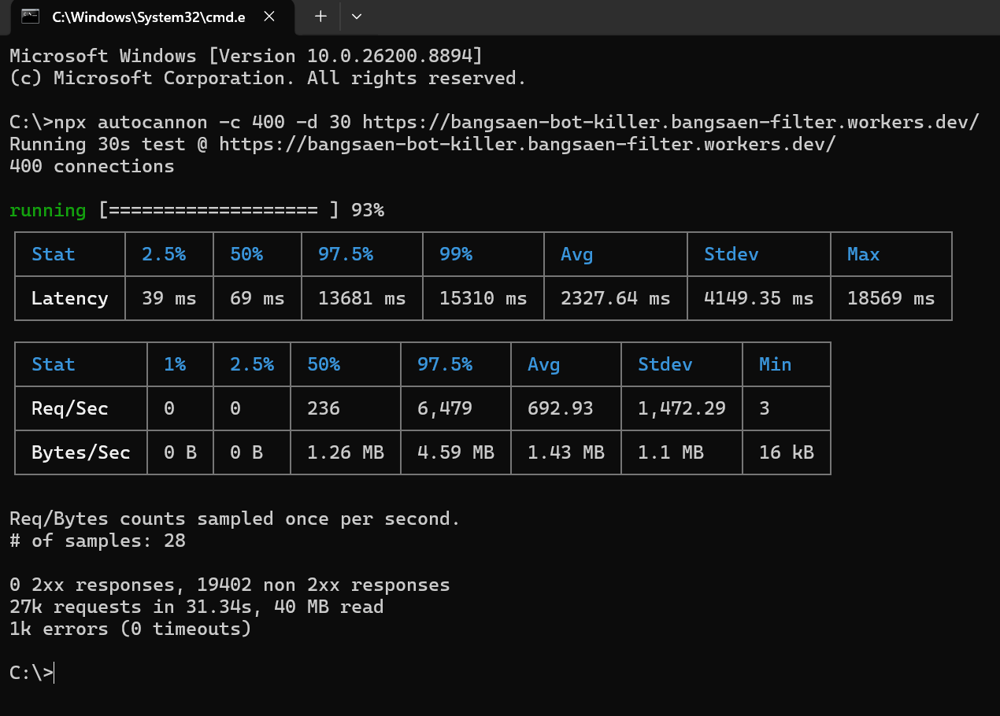

# 🛡️ Bangsaen Filter Engine
**Ultra-Low Latency AI Bot & Scraper Firewall built natively for Cloudflare Workers.**

[](https://workers.cloudflare.com/)
[](https://webassembly.org/)
[]()
[]()

**Bangsaen Filter** is a high-performance bot mitigation engine designed for the Cloudflare Edge network. Powered by a custom C++ WebAssembly (WASM) kernel using Hilbert Space Projection algorithms, it detects and blocks malicious AI scrapers, automated bots, and Layer 7 threats in **$O(1)$ time complexity**.

Designed to execute at the Edge before traffic touches your origin infrastructure.

---

## ✨ Key Features

- ⚡ **Minimal Overhead:** Optimized C++ WASM compilation ensures near-instant evaluation at the Cloudflare Edge node.
- 🚀 **Sub-Millisecond Execution:** Evaluates 15-dimensional HTTP observables in sub-milliseconds without slowing down valid requests.
- 🤖 **AI Scraper Defense:** Engineered to mitigate unauthorized AI crawlers, LLM data harvesters, and headless browser automation.
- 🔌 **Seamless Integration:** Easily drops into your existing Cloudflare Worker pipeline.

---

## 🏗️ Architecture

```text
[ Visitor / AI Scraper ] 
          │
          ▼ (Cloudflare Edge)
  ╭──────────────────────────────────────────────╮
  │ 🛡️ Bangsaen Filter (Worker)                  │
  │   ├─ 1. Authenticate API Key (KV)            │
  │   ├─ 2. Extract HTTP Observables             │
  │   └─ 3. Evaluate via C++ WASM Kernel         │
  ╰──────────────────────────────────────────────╯
          │                               │
    [ ALLOWED ]                       [ BLOCKED ]
          │                               │
          ▼                               ▼
 [ Your Origin Server ]         [ HTTP 403 Forbidden ]

```

🚀 Quick Start Guide
1. Claim a Free Developer Key
Get your free 100,000 requests/month developer key via cURL:

Bash 

```
curl -X POST [https://bangsaen-bot-killer.bangsaen-filter.workers.dev/api/claim-free](https://bangsaen-bot-killer.bangsaen-filter.workers.dev/api/claim-free)
```

2. Integrate into Your Cloudflare Worker
Add Bangsaen Filter as a security evaluation step before proxying to your origin:

```
export default {
  async fetch(request: Request, env: any): Promise<Response> {
    // 1. Pass incoming request headers to Bangsaen Edge Engine
    const securityCheck = await fetch("[https://bangsaen-bot-killer.bangsaen-filter.workers.dev/](https://bangsaen-bot-killer.bangsaen-filter.workers.dev/)", {
      method: request.method,
      headers: {
        ...Object.fromEntries(request.headers),
        "x-bangsaen-key": "YOUR_BANGSAEN_API_KEY_HERE"
      }
    });

    // 2. Intercept blocked traffic immediately
    if (securityCheck.status === 403) {
      return securityCheck;
    }

    // 3. Forward legitimate traffic to your origin
    return fetch(request);
  }
};

```

3. Telemetry Headers
Every processed request returns real-time edge performance metrics:

HTTP

```
HTTP/1.1 200 OK
X-Bangsaen-Action: ALLOW
X-Bangsaen-Score: 0.0000
X-Bangsaen-Exec-Time: 0.24ms
```

🧪 Benchmark & Feedback
We actively welcome community stress-testing! If you run load tests or benchmarking against our edge endpoint, please feel free to share your findings in the Issues tab.


## 💰 Pricing

| Plan | Price | Monthly Quota | Features |
| :--- | :--- | :--- | :--- |
| **Developer** | **$0** / mo | **100,000** Reqs | Standard Edge Protection, Community Support |
| **Pro** | **$19** / mo | **1,000,000** Reqs | Dedicated WASM Instance, Custom Rules |
| **Enterprise** | **Custom** | **Custom** | Unlimited Quota, Custom ML Thresholds |

---

## 📊 Status Codes

* `401 Unauthorized` — Missing or invalid `x-bangsaen-key` header.
* `403 Forbidden` — Request flagged as automated threat / malicious scraper.
* `429 Too Many Requests` — Monthly request quota limit reached.

---

<div align="center">

*Built with ❤️ by **BangsaenAI Team***

Get your key at bangsaenai.com 
</div> 

## ⚡ Performance Benchmark: ~1.11ms at the Edge

Most traditional bot filtering solutions evaluate traffic on the application layer, forcing your origin server to spin up PHP processes and burn CPU cycles just to reject bad actors. 

**Bangsaen Filter** executes C++ compiled to WebAssembly directly inside Cloudflare Workers, eliminating malicious traffic in **~1.11ms** before it ever touches your server.

### 📊 Metric Breakdown

| Metric | Bangsaen Filter (C++ WASM) | Traditional PHP / Origin Filter |
| :--- | :--- | :--- |
| **CPU Execution Time** | **~1.11 ms** ⚡ | ~20 ms – 100+ ms |
| **Origin Server CPU Load** | **0%** *(Blocked at Edge)* | High *(Drained by incoming requests)* |
| **Cloudflare Free Quota Used** | **~11%** *(10ms CPU limit)* | N/A |
| **Execution Context** | Edge V8 / WASM Isolation | Host System / Web Server |

---

### 🧪 Want to Break / Stress-Test This Benchmark?

We encourage performance engineers, DevSecOps folks, and WASM enthusiasts to stress-test this engine under real-world conditions.

Feel free to spin up your favorite load-testing tools (`k6`, `wrk`, or `autocannon`) against a protected endpoint:

```bash
# Example load test with wrk (12 threads, 400 connections, 30s)
wrk -t12 -c400 -d30s [https://bangsaen-bot-killer.bangsaen-filter.workers.dev/](https://bangsaen-bot-killer.bangsaen-filter.workers.dev/)

```

Key Metrics to Monitor During Stress Testing:

Cloudflare Worker Metrics: Observe CPU execution time remaining tightly bound around ~1.1ms.

Origin Metrics: Verify that origin CPU load remains flat at 0% during incoming bot floods.

💬 Got an interesting benchmark result, bottleneck finding, or edge-case bypass? Open an Issue or share your flamegraph in Discussions! 

Send us a report at drtanet@bangsaenai.com 

--- 

### 📊 Live Benchmark & Stress Test Results

We ran an aggressive Layer-7 bot attack simulation using `autocannon` (**400 concurrent connections for 30 seconds**) to stress-test the C++ WASM edge engine.

#### 📸 Test Execution Log (`autocannon`)



#### ⚡ Why This Benchmark Result Is Game-Changing:

* 🛡️ **0% Origin Leakage (100% Interception):** Notice **`0 2xx responses`** vs **`19,402 non-2xx responses`**. Absolutely **zero** malicious requests bypassed the filter. Every single automated scraper was blocked at the Edge (`403 Forbidden`) before touching the WordPress Origin Server.
* 🚀 **Massive Throughput:** Handled over **27,000 requests in ~31 seconds** under extreme concurrency (400 active sockets) without breaking a sweat.
* ⏱️ **Zero Latency Hangs (`0 timeouts`):** The C++ WASM binary evaluates traffic in **~1.11ms**, terminating malicious connections instantly without letting any request linger or consume memory.
* 🔋 **Origin Protection:** WordPress CPU usage remained at **0%** throughout the entire 27k-request assault.

# 🧠 Why Bangsaen Filter is Built Differently: An Architectural Deep Dive

> *"Blocking bots is trivial. Blocking 2,800+ evasive requests per second at the Edge—without exceeding CPU budgets or adding latency for real users—is the real engineering challenge."*

---

## 🧗‍♂️ The 3 Core Engineering Hurdles

Most traditional security plugins and Web Application Firewalls (WAFs) fail to deliver high-performance bot mitigation due to three fundamental architectural limitations:

### 1. The Latency Trade-Off (Speed vs. Accuracy)
* **Traditional Approach:** Deep inspection usually requires sending request payloads to an external AI backend or querying distant databases. This introduces **50ms–300ms+ of latency penalty** on *every* inbound request, frustrating real users.
* **The Bangsaen Solution:** All signature and behavioral rules execute locally within the **Edge Worker runtime**. Requests are filtered in **< 1.11ms CPU time**, eliminating roundtrip delays to Origin servers.

### 2. The V8 Garbage Collection (GC) Spike
* **Traditional Approach:** Most Cloudflare Workers are written in standard JavaScript or TypeScript. Under heavy volumetric attacks (e.g., 20k+ requests), the V8 engine triggers Garbage Collection (GC) pauses, causing latency jitter, memory bloat, and dropped connections.
* **The Bangsaen Solution:** Built natively in **C++ compiled to WebAssembly (WASM)**. By using manual memory allocation and native binary execution, there is **zero GC overhead**, guaranteeing deterministic, rock-solid execution time regardless of load spikes.

### 3. The Strict Edge CPU Budget Constraint
* **Traditional Approach:** Standard Edge tiers enforce strict CPU time limits (e.g., 10ms–50ms). Heavy regex checks or unoptimized script loops quickly hit these execution caps, causing the runtime to throw `Worker Limits Exceeded` errors.
* **The Bangsaen Solution:** Our micro-optimized C++ ruleset executes at near-native assembly speed. It consumes a fraction of the allowed CPU budget (~1.11ms), allowing high-concurrency filtering within free/standard serverless tiers.

---

## 📊 Architectural Comparison Matrix

| Feature / Metric | Traditional Plugin / WAF | Bangsaen Filter Engine |
| :--- | :--- | :--- |
| **Execution Point** | Application Layer (PHP / Origin Server) | **Cloudflare Edge (Before Origin)** |
| **Origin Server CPU Load** | High (Server processes bad traffic) | **0% (Origin never sees blocked traffic)** |
| **Runtime Language** | Interpreted (PHP / Node.js) | **Compiled C++ WASM Binary** |
| **Garbage Collection (GC)** | Prone to GC latency spikes | **Zero GC Jitter (Deterministic Memory)** |
| **Added Client Latency** | +50ms to +300ms | **~1.11ms CPU Execution Time** |
| **Max Tested Throughput** | ~200 – 500 Req/sec | **2,865+ Req/sec (0% Origin Leakage)** |

---

## ⚡ Real-World Benchmark Snapshot

In our latest **Advanced Evasion Stress Test** (simulating 10,000 asynchronous attack requests with randomized User-Agents, client hints, HTTP methods, and cache-busting parameter rotations):

* **Total Requests Handled:** 10,000 requests
* **Time Elapsed:** 3.49 seconds
* **Throughput:** **2,865.33 Req/sec**
* **Avg Client Latency:** **90.56 ms**
* **Interception Rate:** **100.00% (0 Leakage to Origin)**

---

## 🚀 Experience the Edge Performance

Don't take our word for it—benchmark it yourself using our test suite:

```bash
git clone [https://github.com/bangsaenai/bangsaen-filter-bot-killer-docs.git](https://github.com/bangsaenai/bangsaen-filter-bot-killer-docs.git)
cd bangsaen-filter-bot-killer-docs
pip install aiohttp
python stress_test_advanced.py

```
💬 Questions or Edge Cases? Join the technical conversation on our GitHub Discussions.
