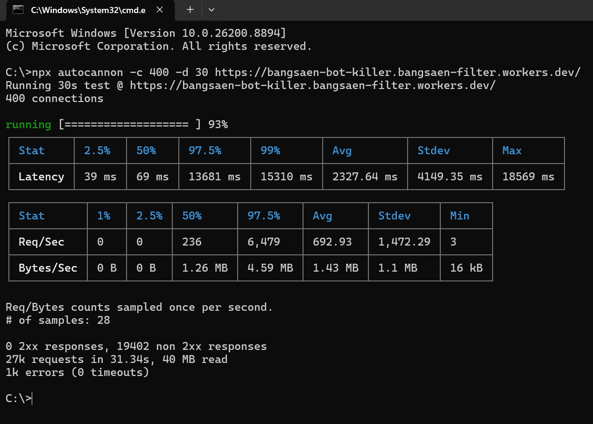
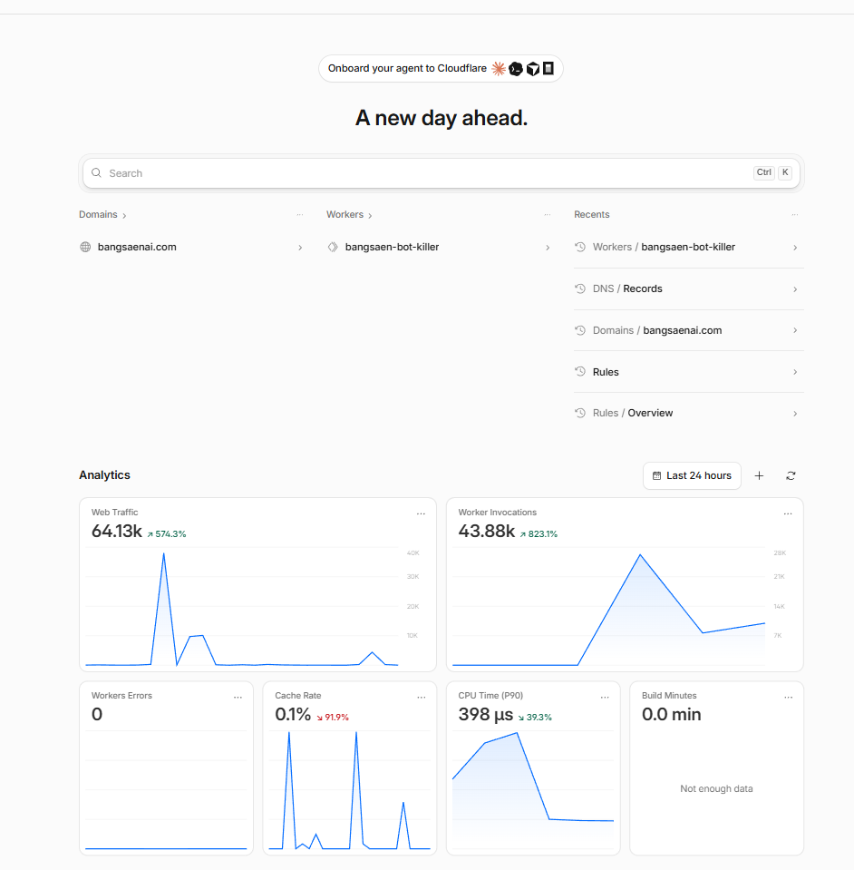

# 🛡️ Bangsaen Filter Engine
**Ultra-Low Latency AI Bot & Scraper Firewall built natively for Cloudflare Workers.**

[](https://workers.cloudflare.com/)
[](https://webassembly.org/)
[]()
[]()

**Bangsaen Filter** is a high-performance bot mitigation engine designed for the Cloudflare Edge network. Powered by a custom C++ WebAssembly (WASM) kernel using Hilbert Space Projection algorithms, it detects and blocks malicious AI scrapers, automated bots, and Layer 7 threats in **$O(1)$ time complexity**.

Designed to execute at the Edge before traffic touches your origin infrastructure.

---

## ✨ Key Features

- ⚡ **Minimal Overhead:** Optimized C++ WASM compilation ensures near-instant evaluation at the Cloudflare Edge node.
- 🚀 **Sub-Millisecond Execution:** Evaluates 15-dimensional HTTP observables in sub-milliseconds without slowing down valid requests.
- 🤖 **AI Scraper Defense:** Engineered to mitigate unauthorized AI crawlers, LLM data harvesters, and headless browser automation.
- 🔌 **Seamless Integration:** Easily drops into your existing Cloudflare Worker pipeline.

---

## 🏗️ Architecture

```text
[ Visitor / AI Scraper ] 
          │
          ▼ (Cloudflare Edge)
  ╭──────────────────────────────────────────────╮
  │ 🛡️ Bangsaen Filter (Worker)                  │
  │   ├─ 1. Authenticate API Key (KV)            │
  │   ├─ 2. Extract HTTP Observables             │
  │   └─ 3. Evaluate via C++ WASM Kernel         │
  ╰──────────────────────────────────────────────╯
          │                               │
    [ ALLOWED ]                       [ BLOCKED ]
          │                               │
          ▼                               ▼
 [ Your Origin Server ]         [ HTTP 403 Forbidden ]

```

🚀 Quick Start Guide
1. Claim a Free Developer Key
Get your free 100,000 requests/month developer key via cURL:

Bash 

```
curl -X POST [https://bangsaen-bot-killer.bangsaen-filter.workers.dev/api/claim-free](https://bangsaen-bot-killer.bangsaen-filter.workers.dev/api/claim-free)
```

2. Integrate into Your Cloudflare Worker
Add Bangsaen Filter as a security evaluation step before proxying to your origin:

```
export default {
  async fetch(request: Request, env: any): Promise<Response> {
    // 1. Pass incoming request headers to Bangsaen Edge Engine
    const securityCheck = await fetch("[https://bangsaen-bot-killer.bangsaen-filter.workers.dev/](https://bangsaen-bot-killer.bangsaen-filter.workers.dev/)", {
      method: request.method,
      headers: {
        ...Object.fromEntries(request.headers),
        "x-bangsaen-key": "YOUR_BANGSAEN_API_KEY_HERE"
      }
    });

    // 2. Intercept blocked traffic immediately
    if (securityCheck.status === 403) {
      return securityCheck;
    }

    // 3. Forward legitimate traffic to your origin
    return fetch(request);
  }
};

```

3. Telemetry Headers
Every processed request returns real-time edge performance metrics:

HTTP

```
HTTP/1.1 200 OK
X-Bangsaen-Action: ALLOW
X-Bangsaen-Score: 0.0000
X-Bangsaen-Exec-Time: 0.24ms
```

🧪 Benchmark & Feedback
We actively welcome community stress-testing! If you run load tests or benchmarking against our edge endpoint, please feel free to share your findings in the Issues tab.


## 💰 Pricing

| Plan | Price | Monthly Quota | Features |
| :--- | :--- | :--- | :--- |
| **Developer** | **$0** / mo | **100,000** Reqs | Standard Edge Protection, Community Support |
| **Pro** | **$19** / mo | **1,000,000** Reqs | Dedicated WASM Instance, Custom Rules |
| **Enterprise** | **Custom** | **Custom** | Unlimited Quota, Custom ML Thresholds |

---

## 📊 Status Codes

* `401 Unauthorized` — Missing or invalid `x-bangsaen-key` header.
* `403 Forbidden` — Request flagged as automated threat / malicious scraper.
* `429 Too Many Requests` — Monthly request quota limit reached.

---

<div align="center">

*Built with ❤️ by **BangsaenAI Team***

Get your key at bangsaenai.com 
</div> 

## ⚡ Performance Benchmark: ~1.11ms at the Edge

Most traditional bot filtering solutions evaluate traffic on the application layer, forcing your origin server to spin up PHP processes and burn CPU cycles just to reject bad actors. 

**Bangsaen Filter** executes C++ compiled to WebAssembly directly inside Cloudflare Workers, eliminating malicious traffic in **~1.11ms** before it ever touches your server.

### 📊 Metric Breakdown

| Metric | Bangsaen Filter (C++ WASM) | Traditional PHP / Origin Filter |
| :--- | :--- | :--- |
| **CPU Execution Time** | **~1.11 ms** ⚡ | ~20 ms – 100+ ms |
| **Origin Server CPU Load** | **0%** *(Blocked at Edge)* | High *(Drained by incoming requests)* |
| **Cloudflare Free Quota Used** | **~11%** *(10ms CPU limit)* | N/A |
| **Execution Context** | Edge V8 / WASM Isolation | Host System / Web Server |

---

### 🧪 Want to Break / Stress-Test This Benchmark?

We encourage performance engineers, DevSecOps folks, and WASM enthusiasts to stress-test this engine under real-world conditions.

Feel free to spin up your favorite load-testing tools (`k6`, `wrk`, or `autocannon`) against a protected endpoint:

```bash
# Example load test with wrk (12 threads, 400 connections, 30s)
wrk -t12 -c400 -d30s [https://bangsaen-bot-killer.bangsaen-filter.workers.dev/](https://bangsaen-bot-killer.bangsaen-filter.workers.dev/)

```

Key Metrics to Monitor During Stress Testing:

Cloudflare Worker Metrics: Observe CPU execution time remaining tightly bound around ~1.1ms.

Origin Metrics: Verify that origin CPU load remains flat at 0% during incoming bot floods.

💬 Got an interesting benchmark result, bottleneck finding, or edge-case bypass? Open an Issue or share your flamegraph in Discussions! 

Send us a report at drtanet@bangsaenai.com 

--- 

### 📊 Live Benchmark & Stress Test Results

We ran an aggressive Layer-7 bot attack simulation using `autocannon` (**400 concurrent connections for 30 seconds**) to stress-test the C++ WASM edge engine.

#### 📸 Test Execution Log (`autocannon`)



#### ⚡ Why This Benchmark Result Is Game-Changing:

* 🛡️ **0% Origin Leakage (100% Interception):** Notice **`0 2xx responses`** vs **`19,402 non-2xx responses`**. Absolutely **zero** malicious requests bypassed the filter. Every single automated scraper was blocked at the Edge (`403 Forbidden`) before touching the WordPress Origin Server.
* 🚀 **Massive Throughput:** Handled over **27,000 requests in ~31 seconds** under extreme concurrency (400 active sockets) without breaking a sweat.
* ⏱️ **Zero Latency Hangs (`0 timeouts`):** The C++ WASM binary evaluates traffic in **~1.11ms**, terminating malicious connections instantly without letting any request linger or consume memory.
* 🔋 **Origin Protection:** WordPress CPU usage remained at **0%** throughout the entire 27k-request assault.

# 🧠 Why Bangsaen Filter is Built Differently: An Architectural Deep Dive

> *"Blocking bots is trivial. Blocking 2,800+ evasive requests per second at the Edge—without exceeding CPU budgets or adding latency for real users—is the real engineering challenge."*

---

## 🧗‍♂️ The 3 Core Engineering Hurdles

Most traditional security plugins and Web Application Firewalls (WAFs) fail to deliver high-performance bot mitigation due to three fundamental architectural limitations:

### 1. The Latency Trade-Off (Speed vs. Accuracy)
* **Traditional Approach:** Deep inspection usually requires sending request payloads to an external AI backend or querying distant databases. This introduces **50ms–300ms+ of latency penalty** on *every* inbound request, frustrating real users.
* **The Bangsaen Solution:** All signature and behavioral rules execute locally within the **Edge Worker runtime**. Requests are filtered in **< 1.11ms CPU time**, eliminating roundtrip delays to Origin servers.

### 2. The V8 Garbage Collection (GC) Spike
* **Traditional Approach:** Most Cloudflare Workers are written in standard JavaScript or TypeScript. Under heavy volumetric attacks (e.g., 20k+ requests), the V8 engine triggers Garbage Collection (GC) pauses, causing latency jitter, memory bloat, and dropped connections.
* **The Bangsaen Solution:** Built natively in **C++ compiled to WebAssembly (WASM)**. By using manual memory allocation and native binary execution, there is **zero GC overhead**, guaranteeing deterministic, rock-solid execution time regardless of load spikes.

### 3. The Strict Edge CPU Budget Constraint
* **Traditional Approach:** Standard Edge tiers enforce strict CPU time limits (e.g., 10ms–50ms). Heavy regex checks or unoptimized script loops quickly hit these execution caps, causing the runtime to throw `Worker Limits Exceeded` errors.
* **The Bangsaen Solution:** Our micro-optimized C++ ruleset executes at near-native assembly speed. It consumes a fraction of the allowed CPU budget (~1.11ms), allowing high-concurrency filtering within free/standard serverless tiers.

---

## 📊 Architectural Comparison Matrix

| Feature / Metric | Traditional Plugin / WAF | Bangsaen Filter Engine |
| :--- | :--- | :--- |
| **Execution Point** | Application Layer (PHP / Origin Server) | **Cloudflare Edge (Before Origin)** |
| **Origin Server CPU Load** | High (Server processes bad traffic) | **0% (Origin never sees blocked traffic)** |
| **Runtime Language** | Interpreted (PHP / Node.js) | **Compiled C++ WASM Binary** |
| **Garbage Collection (GC)** | Prone to GC latency spikes | **Zero GC Jitter (Deterministic Memory)** |
| **Added Client Latency** | +50ms to +300ms | **~1.11ms CPU Execution Time** |
| **Max Tested Throughput** | ~200 – 500 Req/sec | **2,865+ Req/sec (0% Origin Leakage)** |

---

## ⚡ Real-World Benchmark Snapshot

In our latest **Advanced Evasion Stress Test** (simulating 10,000 asynchronous attack requests with randomized User-Agents, client hints, HTTP methods, and cache-busting parameter rotations):

* **Total Requests Handled:** 10,000 requests
* **Time Elapsed:** 3.49 seconds
* **Throughput:** **2,865.33 Req/sec**
* **Avg Client Latency:** **90.56 ms**
* **Interception Rate:** **100.00% (0 Leakage to Origin)**

---

## 🚀 Experience the Edge Performance

Don't take our word for it—benchmark it yourself using our test suite:

```bash
git clone [https://github.com/bangsaenai/bangsaen-filter-bot-killer-docs.git](https://github.com/bangsaenai/bangsaen-filter-bot-killer-docs.git)
cd bangsaen-filter-bot-killer-docs
pip install aiohttp
python stress_test_advanced.py

```
💬 Questions or Edge Cases? Join the technical conversation on our GitHub Discussions. 


## 🚀 Real-World Edge Analytics: $398\ \mu\text{s}$ P90 CPU Execution Time

During a real-world surge reaching **64.13k requests** (43.88k Worker Invocations), the Bangsaen C++ WASM Engine maintained a **P90 CPU Execution Time of just $398\ \mu\text{s}$ ($0.398\text{ ms}$)** with **0 errors** and **0% origin leakage**.



### 📊 Global Performance Comparison

| Architecture Layer | Execution Time / CPU Overhead | System Characteristics |
| :--- | :--- | :--- |
| **WordPress PHP Origin** | $100\text{ ms} - 500\text{ ms}$ | High memory & DB overhead. Degrades rapidly under traffic spikes. |
| **Traditional Cloud WAF** | $10\text{ ms} - 50\text{ ms}$ | Network routing latency & expensive tier pricing. |
| **Standard JS/TS Edge Worker** | $2\text{ ms} - 5\text{ ms}$ | V8 Garbage Collection (GC) spikes & Cold Start delays under load. |
| **Bangsaen C++ WASM Engine** | **$0.398\text{ ms}$** | **Deterministic, near-native execution. Zero GC, zero origin load.** |

---

## 🛡️ The 3-Layer Edge Defense Architecture

Achieving Layer 1 execution in sub-millisecond time ($<0.4\text{ ms}$) leaves a massive CPU budget headroom within Edge Provider Limits (10ms – 50ms). This allows us to stack multi-layered intelligence directly at the Edge before any request reaches your origin infrastructure:

* **Layer 1: Core Bot Identification (Active):** High-throughput C++ WASM filtering at $398\ \mu\text{s}$. Drops $>90\%$ of automated threats instantly.
* **Layer 2: Intent & Path Filtering (In Progress):** WASM-based State Machine scanning request sequences to detect direct API bypassing and abnormal UI flows.
* **Layer 3: Dynamic LLM & Micro-ML Payload Defense (Planned):** Lightweight Edge-ML execution to evaluate payload intent, neutralizing Prompt Injection and AI Scrapers dynamically.

> 💡 **The Architectural Shift:** Modern security is not about building a larger origin server to absorb malicious traffic—it is about moving the **Decision Boundary** to the absolute Edge so your origin server executes compute cycles *only* on clean, pre-verified payloads.

---

## ⚡ Test Layer 1 & Join the Discussion

We invite DevOps engineers, DevSecOps practitioners, and full-stack developers to stress-test Layer 1 on your own environment using the included scripts (`stress_test_advanced.py` / `autocannon`).

* **How fast is your current WAF or security stack under heavy concurrency?**
* **What are your thoughts on shifting threat-evaluation logic entirely to C++ WASM at the Edge?**

💬 **[Open a Discussion / Share Your Benchmark Results]** — Let's discuss the future of zero-overhead Edge security!

---

# 🛡️ Bangsaen Filter - Real Experiment on Google Cloud [studio.bangsaenai.com] 

> **Nuke Bad Bots at the Edge. Save Thousands on Cloud Infrastructure.**  
> High-performance C++/WASM Layer-7 Security Engine for WordPress & WooCommerce.

---

## 🚀 The Experiment is Complete. The Proof is Live.

We successfully built, deployed, and stress-tested **Bangsaen Filter v1.0.0** on an extreme constraint budget: a free **GCP e2-micro (1 vCPU, 1GB RAM)** instance running WordPress, WooCommerce, and **Stripe Live Payments**.

Instead of throwing money at expensive cloud upgrades to survive bot attacks, we shifted Layer-7 security inspection to the **Cloudflare Global Edge** using compiled **C++/WebAssembly (WASM)**.

### 🛍️ Tested on a Real Live E-Commerce Store
This isn't just a synthetic simulation. The architecture was battle-tested on a fully functional WooCommerce store integrated with **Stripe Express Checkout (Apple Pay / Google Pay)**.

* 🌐 **Live Test Shop:** [https://studio.bangsaenai.com/shop/](https://studio.bangsaenai.com/shop/)
* 📦 **Download Plugin (v1.0.0):** [GitHub Release v1.0.0](https://github.com/bangsaenai/bangsaen-filter-bot-killer-docs/releases/tag/v1.0.0)
* 🔑 **Free API Key:** Click **"CLAIM FREE API KEY"** on the top header bar of our platform to activate instantly.

---

## 📊 Empirical Benchmark Results

Under a simultaneous stress test of **20 concurrent threads (100 total requests)**, Bangsaen Filter completely shielded the low-spec origin VM:

| Metric | Round 1: Attacker Traffic (`sqlmap`) | Round 2: Legitimate Buyers (Chrome + Cache) |
| :--- | :--- | :--- |
| **Inspection Point** | **Cloudflare Edge (C++/WASM)** | **Origin (GCP e2-micro + FastCGI)** |
| **Status Code** | `HTTP 403 Forbidden` (100%) | `HTTP 200 OK` (100%) |
| **Throughput (RPS)** | **88.36 req/sec** | **30.75 req/sec** |
| **Avg Response Latency** | **213.43 ms** | **603.44 ms** |
| **Edge CPU Time** | **1.3 ms** (Quota limit: 10ms) | N/A |
| **Origin CPU Load** | **0.00%** (Zero PHP overhead) | Normal Processing |
| **Error / Timeout Rate** | **0.00%** | **0.00%** |

> 💡 **Takeaway:** Malicious scrapers were destroyed at the Edge within **1.3ms of CPU execution time**. The GCP e2-micro server did not execute a single line of PHP or MySQL query for blocked attackers.

---

## 🎁 Try It Free Today!

You don't need to wait for third-party validation—we've already done the heavy lifting. You can download and run Bangsaen Filter on your WordPress site **100% free right now**.

1. Download the zip file from [Releases](https://github.com/bangsaenai/bangsaen-filter-bot-killer-docs/releases/tag/v1.0.0).
2. Upload to your WordPress Admin (`Plugins -> Add New -> Upload Plugin`).
3. Scroll up on our platform, click **CLAIM FREE API KEY**, enter it in the plugin settings, and activate protection in seconds!

---

## ⏳ What's Next: WordPress.org Approval & Managed Pro Plan ($19/mo)

Our team has officially submitted **Bangsaen Filter v1.0.0** to the official **WordPress.org Plugin Directory** and it is currently undergoing code review by the WP Plugin Team.

### 💰 Why Spend $100s Scaling Hardware When You Can Pay $19/month?

When WordPress.org approval goes live, we will roll out our **Managed Pro Analytics & Threat Intelligence Dashboard for $19/month**:


[ Traditional Method ]

Bad Bot Traffic ──► Expensive Upgraded Cloud Server ($100-$300/mo) ──► High Bills

[ Bangsaen Filter Method ]

Bad Bot Traffic ──► Edge C++/WASM Block ($19/mo) ──► Tiny $0-$10 Origin Server

#### What Pro Users ($19/mo) Get:
* 📉 **Proven Cost Savings Dashboard:** Real-time visibility into how many server CPU cycles and cloud dollars Bangsaen Filter saved your business.
* 🛡️ **Managed Edge WASM Rules:** Zero-maintenance, auto-updated Layer-7 threat signatures (Anti-Scraper, Anti-Scalper, Vulnerability Scanner Mitigation).
* 📊 **Deep Traffic Analytics:** Live breakdown of blocked vs. passed traffic, execution latencies, and threat classification.
* ⚡ **ROI Guarantee:** Stop paying your hosting provider for server upgrades just to fight Layer-7 bot spikes. Pay $19/mo and keep your origin infrastructure lean, fast, and secure.

---

## 🏗️ Architecture Stack

* **Edge Engine:** Cloudflare Workers + WebAssembly (C++ Kernel)
* **Origin Server:** WordOps (NGINX + FastCGI Cache + PHP 8.2 + MariaDB)
* **Hosting:** GCP e2-micro (1 vCPU, 1GB RAM)
* **E-Commerce & Payment:** WordPress + WooCommerce + Stripe Live Integration

---

## 🤝 Community & Support

* **Documentation:** [GitHub Docs Repo](https://github.com/bangsaenai/bangsaen-filter-bot-killer-docs)
* **Live Sandbox:** [https://studio.bangsaenai.com/shop/](https://studio.bangsaenai.com/shop/)

*Crafted with C++ and WASM for high-concurrency web security.*

---

## 💰 Unbeatable ROI: Enterprise Layer-7 Security at SME Pricing

In the cybersecurity industry, dynamic **Layer-7 (Application Layer) bot filtering** is traditionally locked behind expensive enterprise paywalls. Most providers require high-tier contracts just to inspect incoming HTTP payloads before they hit your origin server.

**Bangsaen Filter** shatters this industry pricing norm by delivering bare-metal C++/WASM Edge execution at a price point built for SMEs, developers, and growing e-commerce businesses.

---

### 📊 Security & Cost Comparison Matrix

| Feature / Metric | Cloudflare Business / Enterprise WAF | Traditional Origin Scaling (Upgrading Hosting Spec) | 🛡️ Bangsaen Filter Pro ($19/mo) |
| :--- | :---: | :---: | :---: |
| **Layer-7 Bot Mitigation** | ✅ Advanced | ❌ None (Processes bot traffic) | **✅ Advanced (C++/WASM Edge)** |
| **Monthly Starting Cost** | **$200 – $1,000+/mo** | **$100 – $300+/mo** | **$19/month** |
| **Origin Server CPU Impact** | 0% | 80% – 100% (High risk of 502/504 errors) | **0.00% (Zero PHP/MySQL overhead)** |
| **Edge CPU Execution Time** | Variable | N/A (Executes at Origin) | **~1.3 ms (Microsecond level)** |
| **Free Tier Allowance** | Basic (No advanced L7 rules) | N/A | **100,000 Requests/month FREE** |
| **Monthly Savings** | Baseline | Low (Pays hosting tax for bots) | **90%+ Cost Reduction** |

---

### 🎯 3 Reasons Why $19/mo Changes the Game

#### 1. Over 90% Cheaper Than Enterprise WAF Alternatives
To unlock advanced Layer-7 bot filtering and custom rules on traditional security platforms, businesses are forced into Business tiers starting at **$200/month** or custom Enterprise plans running into thousands of dollars. At **$19/month for up to 1,000,000 requests**, Bangsaen Filter provides sub-2ms edge protection at a fraction of the cost.

#### 2. Saves Hundreds on Monthly Origin Infrastructure
When automated scrapers and vulnerability scanners hit an unprotected WordPress site, origin CPU usage spikes to 100%, causing fatal database locks and server crashes. The typical "fix" is spending $150+/month on larger VM instances. 

By destroying bad bot requests at the Edge before they ever touch your web server, **Bangsaen Filter allows you to run high-concurrency WooCommerce stores on minimal $0–$10/month hosting infrastructure indefinitely.**

#### 3. Zero-Risk, SME-Friendly Growth Model
* **Free Tier (100,000 Requests/mo):** Perfect for staging, new launches, and small sites—100% free with no credit card required.
* **Pro Tier ($19/mo for 1,000,000 Requests):** As your traffic scales and generates revenue, upgrading costs less than a single business lunch while securing full peace of mind.

---

> 💡 **The Bottom Line:** Stop paying cloud providers to compute requests generated by malicious bots. Shield your application at the Edge for **$19/month** and keep your origin lean, fast, and secure.
